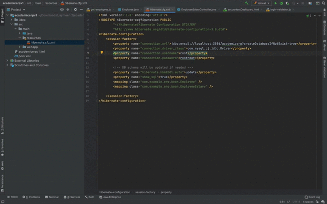

### In this project, we have implemented a small part of the entire academic erp that is Disburse the salary of the employees and adding an employee to the database.

In this project, we have used HTML, CSS, JavaScript for the frontend and We use Hibernate(Java) as the backend and MySql as the database.

To run this project do the following.

(1) import `academicerp.sql` to your MySql database.

(2) The source code is inside the `academicerpv1` folder so open this folder in the Intellij IDEA code editor.

(3) Now we need to specify your MySql database `username` and `password` inside the `hibernate.cfg.xml` file. To do so go to `src->resources->hibernate.cfg.xml`. 
Inside that change following 2 lines. Instead of root and rootroot write your MySql username and password.
``` 
<property name="connection.username">root</property>
<property name="connection.password">rootroot</property>
```
Now your database is configuration is done. Now the application will be able to talk to the database and store and retrieve the data from it.

(4) Final step is to make the run application itself. For that, you need to download `Apache Tomcat` on which we will be running our web application.

After Downloading unzip it and store it in the location of your choice(preferably in the same folder as the application is in). 

We need to pass apache tomcat folder path while we configure it. As show in following gif video.





